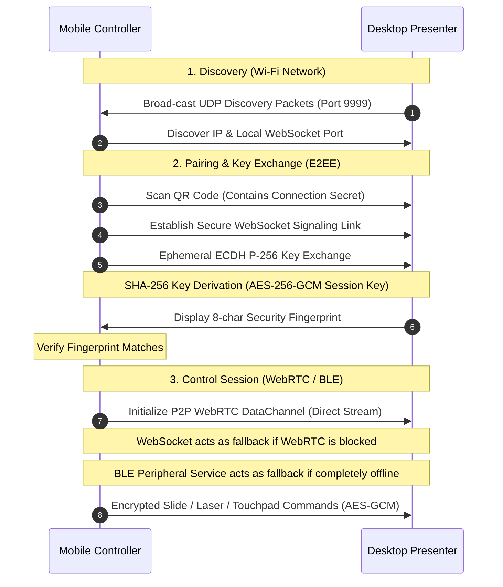

# 🛰️ AirDeck: Secure Multi-Platform PPT Controller Ecosystem

[](#)
[](#)
[](#)
[](#)
[](#)
[](#)
[](#)

AirDeck is a real-time, low-latency, end-to-end encrypted (E2EE) presentation companion system. It allows presenters to control desktop-based slide shows from their mobile devices over multiple redundant channels (Wi-Fi, WebRTC, WebSocket, or Bluetooth Low Energy), even in completely offline environments.

---

## 🎨 Design Philosophy

AirDeck is styled around a custom **Swiss / Flat Minimalist Design System** designed to look clean, highly legible, and premium:
- **Monochrome & Neutral**: A dark UI consisting of shades of black, muted charcoal, and stark whites. No gradient shadows or bright colored accents.
- **Strictly Flat**: No drop shadows, inner shadows, or blurring effects. All elements rest flat against their background.
- **Geometric & Sharp**: Borders have sharp (`0px`) or very subtly softened (`2px` / `16px` for cards) corners.
- **Spacious Typography**: Generous padding and margins allow for negative space, prioritizing typographic scale and layout clarity.

---

## ✨ Ecosystem Features

### 💻 AirDeck Presenter (Desktop App)
- **Local encrypted library database** (`library.enc`) protecting presentation metadata, star lists, and files using AES-256-GCM.
- **Native PPTX Parsing & Rendering**: Extracts slides, metadata, and slide notes directly from PowerPoint XML structures, converting slides to optimized image sequences.
- **Native PDF Parsing**: Processes PDF files as slide sequences using a native fallback parser.
- **Local Network Discovery**: Runs a background UDP discovery engine allowing mobile devices to find local IP addresses automatically.
- **Redundant Communication Servers**: Runs WebRTC and fallback WebSocket signaling servers for local connection.
- **BLE GATT Peripheral**: Hosts a Bluetooth LE GATT peripheral service to transmit slide controller commands offline.

### 📱 AirDeck Controller (Mobile App)
- **Zero-config QR Pairing**: Scan a QR code displayed on the presenter screen to automatically pair, discover local IP endpoints, and verify connection.
- **Offline BLE Controller**: Scan, pair, and send slide navigation commands offline via Bluetooth LE.
- **Gesture Control Touchpad**: Swipe and tap to trigger prev/next transitions and scroll slide lists.
- **Live Slide Previews & Presenter Notes**: View slide thumbnails, list of slide titles (Table of Contents), and corresponding speaker notes in real-time.
- **Laser Pointer Synchronizer**: Touch and drag on the mobile interface to draw and guide an interactive laser pointer on the desktop presentation view.

---

## 🔒 Security & Encryption Architecture

To guarantee presentation privacy, all device communication uses an **End-to-End Encrypted (E2EE)** channel:

1. **Key Exchange (ECDH P-256)**: On connection (Wi-Fi or Bluetooth), the controller and presenter exchange ephemeral public keys using the **NIST P-256** elliptic curve.
2. **Key Derivation (SHA-256)**: Both sides calculate the shared secret and run it through a **SHA-256** key derivation function to generate a 32-byte symmetric session key.
3. **Session Verification**: The presenter displays an 8-character verification fingerprint derived from the session key. Once verified, all communication uses symmetric encryption.
4. **Symmetric Encryption**: All subsequent commands (slides, gestures, notes) are packaged and encrypted with **AES-256-GCM**.
5. **Encrypted Local Storage**: The presenter's local data is stored in `library.enc` inside the user config path. It is encrypted with AES-256-GCM using a key derived from a user-supplied master passphrase on startup.

---

## 📡 Network & Transport Layers



---

## 📁 Workspace Layout

The workspace is organized into two primary project directories:

```
ppt-dapp/
├── README.md                           # Main Ecosystem documentation
├── RUN.md                              # Quick startup guides
├── desktop/                            # Native Desktop Wails Project
│   ├── main.go                         # App launcher and entry point
│   ├── app.go                          # Go backend logic & JS-IPC bindings
│   ├── wails.json                      # Wails build configuration
│   ├── pptx_to_images.py               # PowerPoint to image conversion script (win32com)
│   ├── internal/
│   │   ├── ble/                        # BLE GATT peripheral driver
│   │   ├── crypto/                     # AES-256-GCM and P-256 ECDH crypto modules
│   │   ├── discovery/                  # UDP discovery beacon service
│   │   ├── pdf/                        # PDF parser treating pages as slides
│   │   ├── pptx/                       # PPTX XML parser (extracts notes & text)
│   │   ├── storage/                    # Encrypted local JSON database engine
│   │   └── webrtc/                     # WebRTC P2P handler & WebSocket signaling
│   └── frontend/                       # React frontend code
│       ├── package.json                # Frontend dependencies
│       └── src/
│           ├── App.tsx                 # Main layout and screen router
│           ├── style.css               # Swiss minimalist CSS styling
│           └── screens/
│               ├── LockScreen.tsx      # Passphrase authentication
│               ├── DashboardScreen.tsx # Slide upload & session setup
│               └── PresentationScreen.tsx # Screen mirror & pairing QR view
└── mobile-stable/                      # Expo Mobile Application
    ├── app.json                        # Expo build configuration
    ├── package.json                    # Expo dependencies
    ├── app/                            # React Native App (Expo Router)
    │   ├── _layout.tsx                 # Base layout
    │   ├── index.tsx                   # Launch screen
    │   ├── App.tsx                     # Global providers and navigation
    │   ├── components/                 # Screen widgets (QRScanner, Touchpad, Tabs)
    │   └── screens/
    │       ├── ConnectScreen.tsx       # Landing page (Wi-Fi QR scan / BLE scan)
    │       ├── AuthenticatingScreen.tsx# Handshake status page
    │       └── ControllerScreen.tsx    # Slide remote touchpad & notes
    └── src/
        └── services/
            ├── connection.ts           # Unified connection adapter (WebRTC, BLE, WS)
            └── crypto.ts               # Mobile ECDH and AES-256-GCM utilities
```

### 🔗 Key Source Files:
- Go main controller: [desktop/app.go](file:///e:/Projects/ppt-dapp/desktop/app.go)
- Mobile connection layer: [mobile-stable/src/services/connection.ts](file:///e:/Projects/ppt-dapp/mobile-stable/src/services/connection.ts)
- Mobile crypto functions: [mobile-stable/src/services/crypto.ts](file:///e:/Projects/ppt-dapp/mobile-stable/src/services/crypto.ts)
- Desktop crypto functions: [desktop/internal/crypto/](file:///e:/Projects/ppt-dapp/desktop/internal/crypto)
- PPTX slide parser: [desktop/internal/pptx/parser.go](file:///e:/Projects/ppt-dapp/desktop/internal/pptx/parser.go)
- PDF slide parser: [desktop/internal/pdf/parser.go](file:///e:/Projects/ppt-dapp/desktop/internal/pdf/parser.go)

---

## 🚀 Running the Apps

For detailed setup, configuration options, and running options, refer to the [RUN.md](file:///e:/Projects/ppt-dapp/RUN.md) run sheet.

### Quick Start (Desktop)
Ensure you have [Go](https://go.dev/) and [Wails](https://wails.io/) installed.
```bash
cd desktop
wails dev
```
To build a standalone production binary:
```bash
wails build
```

### Quick Start (Mobile)
Ensure you have [Node.js](https://nodejs.org/) installed.
```bash
cd mobile-stable
npm install
npm run start
```
*Scan the QR code displayed in the terminal with **Expo Go** on your iOS/Android device to load the client.*

For full native module capabilities (including Bluetooth LE scanning and native WebRTC PeerConnections), launch native compiler builds:
```bash
# Android
npm run android

# iOS
npm run ios
```
